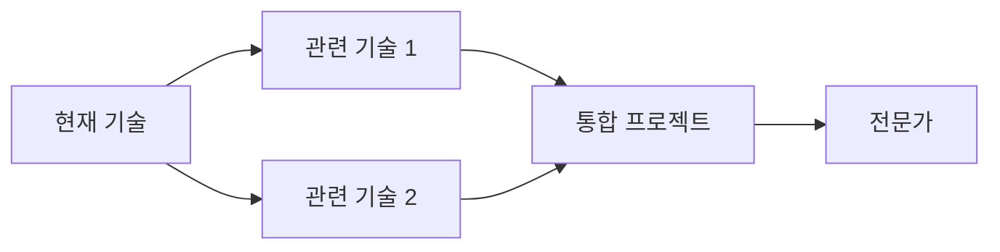

# 섹션별 작성 가이드라인

이 문서는 각 섹션을 작성할 때 따라야 할 상세한 가이드라인을 제공합니다.

## 목차

1. [개요 섹션 작성법](#1-개요-섹션-작성법)
2. [시작하기 섹션 작성법](#2-시작하기-섹션-작성법)
3. [핵심 개념 섹션 작성법](#3-핵심-개념-섹션-작성법)
4. [사용법 섹션 작성법](#4-사용법-섹션-작성법)
5. [실무 예제 섹션 작성법](#5-실무-예제-섹션-작성법)
6. [베스트 프랙티스 섹션 작성법](#6-베스트-프랙티스-섹션-작성법)
7. [트러블슈팅 섹션 작성법](#7-트러블슈팅-섹션-작성법)
8. [추가 학습 자료 섹션 작성법](#8-추가-학습-자료-섹션-작성법)
9. [결론 섹션 작성법](#9-결론-섹션-작성법)

---

## 1. 개요 섹션 작성법

### 목적

독자가 5분 안에 다음을 이해하도록:
- 이 기술이 무엇인가?
- 왜 배워야 하는가?
- 나에게 적합한가?

### 1.1 {기술명}란?

**작성 원칙:**
- 첫 문장에 핵심 정의
- 비유나 메타포 활용 (복잡한 개념일 경우)
- 기술적 배경 간단히 설명
- 탄생 배경 및 역사 (선택사항)

**좋은 예:**
> FastAPI는 Python 3.6+ 기반의 현대적인 웹 프레임워크로, 타입 힌트를 활용하여 빠르고 안전한 API를 쉽게 만들 수 있습니다.

**나쁜 예:**
> FastAPI는 웹 프레임워크입니다.

### 1.2 주요 특징

**작성 원칙:**
- 3-5개의 핵심 특징만 선정
- 각 특징에 구체적인 이점 설명
- 경쟁 기술과의 차별점 강조
- 가능하면 수치로 증명 (예: "Flask보다 2배 빠름")

**구조:**
```markdown
- **특징명**: 특징 설명과 실제 이점
  - 구체적인 예시나 사용 케이스
```

**작성 팁:**
- "빠르다", "쉽다"보다는 "무엇이 얼마나" 명시
- 실무 관점에서의 가치 설명
- 학습 곡선 언급 (솔직하게)

### 1.3 왜 사용하는가?

**장점 작성:**
- 실무에서 체감하는 장점 위주
- 추상적인 장점 지양
- "생산성 향상" → "API 개발 시간 50% 단축"

**고려사항 작성:**
- 단점을 솔직하게 언급 (신뢰도 ↑)
- 학습 비용, 생태계 성숙도 등
- "이런 경우엔 안 맞아요" 명시

**비교표 작성:**
- 주요 경쟁 기술 2-3개
- 핵심 기능 5-7개 항목
- 객관적 사실 기반 (주관적 평가 X)

### 1.4 사용 사례

**적합한 경우:**
- 구체적인 프로젝트 유형 나열
- 팀 규모, 프로젝트 규모 언급
- 예: "마이크로서비스 아키텍처의 RESTful API"

**부적합한 경우:**
- 명확히 안 맞는 케이스 제시
- 이유 함께 설명
- 대안 기술 제안 (선택사항)

---

## 2. 시작하기 섹션 작성법

### 목적

독자가 30분 안에:
- 설치 완료
- "Hello World" 실행 성공
- 기본 개발 환경 구축

### 2.1 사전 요구사항

**필수 지식:**
- 정말 필요한 지식만
- 각 지식의 필요 수준 명시
  - 예: "Python 기초 (변수, 함수, 클래스 이해)"
- 없으면 어떻게 되는지 설명

**시스템 요구사항:**
- 최소 사양과 권장 사양 구분
- 실제 테스트한 환경 명시
- 디스크 용량은 실제 설치 후 크기

**필수 도구:**
- 정확한 버전 범위 명시
- 버전 호환성 정보
- 각 도구의 역할 간단히 설명

### 2.2 설치 방법

**각 OS별 섹션:**
- 가장 쉬운 방법 먼저 제시
- 패키지 매니저 우선 (brew, apt, choco 등)
- 수동 설치는 대안으로 제공

**명령어 작성 원칙:**
- 복사-붙여넣기 가능하게
- 각 명령어에 주석 추가
- 예상 소요 시간 언급 (대용량 다운로드 시)

**설치 확인:**
- 반드시 버전 확인 명령어 포함
- 예상 출력 보여주기
- 실패 시 체크사항 제공

### 2.3 초기 설정

**설정 파일:**
- 최소 설정만 먼저 제공
- 각 설정 항목 설명
- 기본값과 다르게 설정하는 이유 설명

**환경 변수:**
- 필수/선택 구분
- 보안 관련 변수는 주의 문구
- `.env` 파일 사용 권장

### 2.4 첫 번째 프로젝트

**Hello World 원칙:**
- 5분 안에 실행 가능
- 최소한의 코드
- 핵심 기능 1-2개만 사용
- 성공 여부를 명확히 확인 가능

**단계별 구조:**
1. 프로젝트 생성
2. 파일 작성
3. 실행
4. 결과 확인

**각 단계마다:**
- 왜 이 단계가 필요한지
- 예상 시간
- 문제 발생 시 체크포인트

---

## 3. 핵심 개념 섹션 작성법

### 목적

독자가 기술의 "작동 원리"를 이해:
- 왜 그렇게 설계되었는가?
- 내부적으로 어떻게 동작하는가?
- 주요 용어와 개념

### 3.1 기본 개념

**개념 설명 구조:**

```markdown
**개념명: {영어명}**

{한 문장 정의}

{상세 설명}

**비유/메타포:**
{복잡한 개념을 일상 예시로}

**코드 예제:**
```언어
// 개념을 보여주는 최소 코드
```

**실무 활용:**
{이 개념이 실제로 어디에 쓰이는지}
```

**작성 팁:**
- 추상 개념 → 구체 예시 순서
- 다이어그램 적극 활용 (Mermaid)
- "왜?"에 대한 답변 포함

### 3.2 주요 기능

**기능 설명 구조:**

```markdown
#### 기능명

**용도:** {어떤 문제를 해결하는가}

**기본 사용법:**
```언어
// 가장 간단한 예제
```

**주요 옵션:**
| 옵션 | 타입 | 기본값 | 설명 |
|------|------|--------|------|
| ... | ... | ... | ... |

**고급 예제:**
```언어
// 옵션을 활용한 예제
```

**주의사항:**
- 주의할 점 1
- 주의할 점 2
```

### 3.3 작동 원리

**다이어그램 작성:**
- Mermaid 문법 사용
- 복잡도는 중간 수준 유지
- 핵심 흐름만 표현

**처리 흐름 설명:**
- 단계별로 번호 매기기
- 각 단계가 하는 일 명확히
- 시간 순서대로 (동기) 또는 이벤트 기반 (비동기)

---

## 4. 사용법 섹션 작성법

### 목적

독자가 주요 기능을 실제로 사용할 수 있게:
- 기본 → 중급 → 고급 순서
- 각 기능의 실용적 활용법
- 언제, 왜 사용하는지

### 4.1 기본 사용법

**CRUD 패턴:**
- Create (생성)
- Read (조회)
- Update (수정)
- Delete (삭제)

**각 작업마다:**
- 최소 코드 예제
- 파라미터 설명
- 반환값 설명
- 에러 처리 기본

### 4.2 주요 기능 활용

**기능별 섹션 구조:**

```markdown
#### {기능명}

**시나리오:**
{이 기능이 필요한 실제 상황}

**구현:**
```언어
// 단계별 코드
```

**설명:**
{코드의 각 부분 설명}

**결과:**
```
{실행 결과}
```

**응용:**
{이 패턴을 확장할 수 있는 방법}
```

### 4.3 고급 기능

**고급 기능 선정 기준:**
- 처음엔 필요 없지만 나중에 유용
- 성능 최적화 관련
- 복잡한 비즈니스 로직 구현 시

**작성 시 주의:**
- 전제 조건 명확히
- 기본 기능과의 차이점 강조
- "왜 고급인가?" 설명

### 4.4 설정 및 커스터마이징

**설정 옵션 표:**
- 옵션명, 타입, 기본값, 설명
- 자주 변경하는 설정 먼저
- 실무에서 변경이 필요한 이유

---

## 5. 실무 예제 섹션 작성법

### 목적

독자가 실제 프로젝트에 적용 가능하도록:
- 완전한 작동 코드
- 실무 시나리오 기반
- 점진적 복잡도

### 실무 예제 작성 7원칙

1. **실행 가능성**: 복사-붙여넣기로 바로 실행
2. **완전성**: 모든 import, 설정 포함
3. **현실성**: 실제 프로젝트에서 마주칠 상황
4. **교육성**: 명확한 학습 목표
5. **확장성**: 더 발전시킬 수 있는 여지
6. **주석**: 핵심 코드에 한글 설명
7. **검증**: 실제 실행하여 테스트된 코드

### 예제 구조 템플릿

```markdown
### 예제 N: {실무 시나리오 제목}

**난이도:** ⭐⭐⭐ (초급/중급/고급)

**예상 소요 시간:** {시간}

**학습 목표:**
- [ ] 목표 1
- [ ] 목표 2
- [ ] 목표 3

**시나리오:**

{2-3문장으로 실무 상황 묘사}

예: "전자상거래 사이트에서 사용자가 장바구니에 상품을 추가할 때마다
재고를 실시간으로 확인하고 업데이트해야 합니다."

**사용 기술:**
- 기술/라이브러리 1 (버전)
- 기술/라이브러리 2 (버전)

**프로젝트 구조:**
```
project-name/
├── src/
│   ├── main.ext
│   ├── config.ext
│   └── utils.ext
├── tests/
│   └── test_main.ext
├── requirements.txt  # 또는 package.json 등
└── README.md
```

**구현 단계:**

#### Step 1: 프로젝트 설정 및 의존성 설치

{왜 이 의존성들이 필요한지 설명}

```bash
# 프로젝트 디렉토리 생성
mkdir project-name && cd project-name

# 의존성 파일 작성
cat > requirements.txt << EOF
package1==1.0.0
package2==2.0.0
EOF

# 설치
pip install -r requirements.txt
```

#### Step 2: 설정 파일 작성

`config.ext`:
```언어
# 설정 내용
# 각 설정의 역할 주석 포함
```

#### Step 3: 유틸리티 함수 구현

`src/utils.ext`:
```언어
/**
 * 함수 설명
 */
function helperFunction() {
    // 구현
    // 핵심 로직에 주석
}
```

#### Step 4: 메인 로직 구현

`src/main.ext`:
```언어
// 전체 프로그램의 핵심 로직
// 단계별로 주석 추가

// 1. 초기화
// 2. 데이터 처리
// 3. 결과 반환
```

#### Step 5: 테스트 작성

`tests/test_main.ext`:
```언어
// 단위 테스트
// 경계값 테스트
// 에러 케이스 테스트
```

#### Step 6: 실행 및 확인

```bash
# 실행 명령어
python src/main.py

# 또는 테스트 실행
pytest tests/
```

**예상 출력:**
```
[정확한 출력 내용]
Status: Success
Result: ...
```

**코드 설명:**

**전체 흐름:**
1. {단계 1 설명}
2. {단계 2 설명}
3. {단계 3 설명}

**핵심 포인트:**

1. **{포인트 1}**:
   - 코드: `특정 코드 조각`
   - 설명: {왜 이렇게 구현했는지}
   - 대안: {다른 방법과 비교}

2. **{포인트 2}**:
   - ...

**에러 처리 전략:**
- 예외 상황 1: 처리 방법
- 예외 상황 2: 처리 방법

**성능 고려사항:**
- 병목 지점: {설명}
- 최적화 방법: {설명}

**보안 고려사항:**
- 취약점 1: 방어 방법
- 취약점 2: 방어 방법

**확장 아이디어:**

- [ ] **기능 추가 1**: {설명}
  - 구현 난이도: ⭐⭐
  - 예상 시간: 30분
  - 힌트: {구현 힌트}

- [ ] **기능 추가 2**: {설명}
  - ...

**트러블슈팅:**

**문제 1**: "에러 메시지"
- **원인**: {설명}
- **해결**: {방법}

**문제 2**: 성능 저하
- **증상**: {설명}
- **해결**: {방법}

**관련 리소스:**
- [참고 문서 1](URL)
- [참고 문서 2](URL)
```

### 예제 난이도 배정

**예제 1 (초급):**
- 핵심 기능 1-2개만 사용
- 복잡도 최소화
- 명확한 입출력
- 30줄 이내 코드

**예제 2 (중급):**
- 여러 기능 조합
- 에러 처리 포함
- 실무 패턴 적용
- 50-100줄 코드

**예제 3 (고급):**
- 복잡한 비즈니스 로직
- 최적화 기법 적용
- 테스트, 로깅, 모니터링
- 100줄 이상 (여러 파일)

---

## 6. 베스트 프랙티스 섹션 작성법

### 목적

독자가 프로덕션 품질 코드를 작성하도록:
- 검증된 패턴
- 피해야 할 안티패턴
- 실무 경험에서 나온 조언

### 6.1 성능 최적화

**Before/After 패턴:**

```markdown
**최적화 N: {제목}**

**문제:**
{왜 성능 문제가 되는가}

```언어
// 비효율적인 코드
// 문제가 되는 부분 주석
```

**벤치마크:**
- 실행 시간: {시간}
- 메모리 사용: {용량}
- CPU 사용률: {퍼센트}

**개선:**

```언어
// 최적화된 코드
// 개선된 부분 주석
```

**벤치마크:**
- 실행 시간: {시간} (△{개선률}%)
- 메모리 사용: {용량} (△{개선률}%)
- CPU 사용률: {퍼센트} (△{개선률}%)

**설명:**
{왜 빨라졌는지 기술적 설명}

**적용 시기:**
- 상황 1
- 상황 2

**주의사항:**
- 주의할 점
```

### 6.2 보안 고려사항

**취약점 → 해결 패턴:**

```markdown
**보안 이슈 N: {이슈명}**

**위험도:** 🔴 높음 / 🟡 중간 / 🟢 낮음

**공격 시나리오:**
{실제로 어떻게 공격당할 수 있는지}

**취약한 코드:**
```언어
// 위험한 코드
```

**공격 예시:**
```
{실제 공격 페이로드}
```

**안전한 코드:**
```언어
// 방어 코드
```

**설명:**
{왜 안전한지}

**추가 방어 계층:**
- 방어책 1
- 방어책 2

**참고:**
- [OWASP 가이드](URL)
- [CVE-XXXX-XXXXX](URL)
```

### 6.3 테스트 전략

**테스트 피라미드:**
```
      /\
     /E2E\
    /------\
   /통합 테스트\
  /------------\
 /  단위 테스트   \
/----------------\
```

**각 레벨별 가이드:**
- 비율: 단위 70%, 통합 20%, E2E 10%
- 도구 추천
- 예제 코드

### 6.4 프로덕션 배포

**체크리스트 형식:**
- [ ] 항목 1: {설명 및 확인 방법}
- [ ] 항목 2: {설명 및 확인 방법}

**CI/CD 파이프라인 예제**

---

## 7. 트러블슈팅 섹션 작성법

### 목적

독자가 문제를 스스로 해결할 수 있도록:
- 일반적인 오류 해결법
- 디버깅 전략
- 도움 받는 방법

### 7.1 자주 발생하는 오류

**오류 문서화 템플릿:**

```markdown
#### 오류 {번호}: {짧은 설명}

**오류 메시지:**
```
[정확한 오류 메시지 전체]
Stack trace 포함
```

**발생 빈도:** ⭐⭐⭐⭐⭐ (매우 흔함)

**발생 시점:**
- 상황 1
- 상황 2

**원인:**

1. **근본 원인**: {기술적 설명}
2. **직접적 원인**: {사용자 액션}

**재현 방법:**
```bash
# 오류를 의도적으로 발생시키는 코드/명령어
```

**해결 방법:**

**방법 1: {이름}** (권장)

{왜 권장하는지}

```bash
# 해결 명령어/코드
```

검증:
```bash
# 해결 확인 방법
```

**방법 2: {이름}** (대안)

{언제 사용하는지}

```bash
# 대안 명령어/코드
```

**방법 3: {이름}** (최후의 수단)

{부작용 경고}

```bash
# 강제 해결 명령어
```

**예방책:**
- [ ] 예방 1: {설명}
- [ ] 예방 2: {설명}

**관련 이슈:**
- GitHub Issue #123
- Stack Overflow: [링크](URL)

**FAQ:**
- Q: {자주 묻는 질문}
- A: {답변}
```

### 7.2 디버깅 팁

**디버깅 워크플로우:**

1. **증상 파악**
   - 체크리스트 제공

2. **로그 수집**
   ```bash
   # 로그 명령어
   ```

3. **디버그 모드 활성화**
   ```bash
   # 디버그 명령어
   ```

4. **단계별 추적**
   - 방법론 제시

**유용한 도구:**
| 도구 | 용도 | 설치 | 사용법 |
|------|------|------|--------|
| ... | ... | ... | ... |

### 7.3 성능 문제 해결

**성능 프로파일링 가이드:**

1. 문제 재현
2. 메트릭 수집
3. 병목 지점 식별
4. 최적화 적용
5. 검증

---

## 8. 추가 학습 자료 섹션 작성법

### 목적

독자가 스스로 학습을 이어갈 수 있도록:
- 신뢰할 수 있는 자료
- 난이도별 분류
- 학습 경로 제시

### 8.1 공식 문서

**필수 링크:**
- 공식 홈페이지
- API 레퍼런스
- 마이그레이션 가이드
- 릴리스 노트
- GitHub 저장소

### 8.2 추천 튜토리얼

**분류 기준:**
- 난이도 (초/중/고급)
- 매체 (글/영상/인터랙티브)
- 언어 (한국어/영어)
- 무료/유료

**리스트 형식:**
```markdown
- **[튜토리얼 제목](URL)** (난이도: ⭐⭐)
  - 저자/출처
  - 소요 시간: {시간}
  - 다루는 내용: {간단 설명}
  - 추천 이유: {왜 좋은지}
```

### 8.3 커뮤니티 리소스

**활성화된 커뮤니티:**
- Discord 서버
- Slack 워크스페이스
- Reddit 서브레딧
- Stack Overflow 태그

**각 커뮤니티별:**
- 링크
- 활성도
- 분위기 (초보자 친화적인지 등)
- 주요 채널/스레드

---

## 9. 결론 섹션 작성법

### 목적

독자에게 동기 부여와 방향 제시:
- 배운 내용 정리
- 다음 단계 안내
- 자신감 고취

### 9.1 핵심 요약

**구조:**

```markdown
**이 가이드를 마치면 할 수 있는 것:**

✅ 할 수 있게 된 것 1
✅ 할 수 있게 된 것 2
✅ 할 수 있게 된 것 3

**핵심 개념 복습:**

1. **개념 1**: 한 문장 요약
2. **개념 2**: 한 문장 요약
3. **개념 3**: 한 문장 요약

**자주 사용하는 코드 스니펫:**

```언어
// 가장 많이 쓰는 패턴 1
```

```언어
// 가장 많이 쓰는 패턴 2
```
```

### 9.2 다음 단계

**학습 로드맵:**

```markdown
**1주차: 기초 다지기**
- [ ] 기본 예제 모두 실습
- [ ] 공식 튜토리얼 완료
- [ ] 간단한 개인 프로젝트 (예: {프로젝트})

**1개월차: 실전 적용**
- [ ] 실무 프로젝트에 적용
- [ ] 고급 기능 학습
- [ ] 커뮤니티 Q&A 활동

**3개월차: 전문가 되기**
- [ ] 복잡한 시스템 구축
- [ ] 오픈소스 기여
- [ ] 블로그 글 작성 또는 발표

**6개월차: 마스터**
- [ ] 다른 사람 멘토링
- [ ] 라이브러리/도구 개발
- [ ] 컨퍼런스 발표
```

**추천 학습 순서:**



**프로젝트 아이디어:**
- 초급: {프로젝트 1}
- 중급: {프로젝트 2}
- 고급: {프로젝트 3}

---

## 작성 시 공통 주의사항

### 파일별 어조와 문체

#### lecture-script.md — 격식체 낭독 스크립트

**문체: ~합니다 격식체 엄수**

✅ **사용:**
- "이제 설치하겠습니다."
- "이 기능은 다음과 같이 동작합니다."
- "주의: 이 명령어는 데이터를 삭제합니다."
- "화면에서 다음 명령어를 실행합니다."
- "실행하면 버전 정보가 출력됩니다."

❌ **금지 — 비격식체:**
- "설치해볼게요." → "설치해보겠습니다."
- "이 기능이에요." → "이 기능입니다."
- "이거 중요하거든요." → "이것이 중요한 이유는 ~기 때문입니다."

❌ **금지 — 청중 참여 문구:**
- "여러분, ~하세요?" → 서술형으로 전환
- "따라해보세요." → 제거
- "~계신 분 있으시죠?" → 제거
- "여기서 질문 드리겠습니다." → 제거

**라이브 코딩 서술 패턴:**
- 코드 전: `"화면에서 다음 명령어를 실행합니다."` / `"터미널에 다음을 입력합니다."`
- 코드 후: `"실행하면 {결과}를 확인할 수 있습니다."` / `"출력에서 {사항}을 볼 수 있습니다."`

#### README.md — 시청자용 레퍼런스

**형식: 스캔 가능한 참조 문서**

✅ **사용:**
- 체크박스 목록 (`- [ ]`)
- 표 형식 (단축키, 별칭, 트러블슈팅)
- 완전한 코드 블록 (부분 발췌 금지)
- 간결한 서술 (설명 최소화, 명령어 최대화)

❌ **금지:**
- 강의 스크립트 수준의 긴 설명
- 불완전한 코드 (전체 설정 파일의 일부만 발췌)
- 표 없이 나열하는 트러블슈팅

### 코드 품질

**모든 코드는:**
- 실제 실행 가능
- 구문 하이라이팅 지정 (```python, ```javascript 등)
- 주요 부분에 주석
- 일관된 스타일 (PEP8, ESLint 등)

### 링크 관리

- 공식 문서 링크만 사용
- 깨진 링크 주기적 확인
- URL 단축 서비스 사용 금지
- 가능하면 버전 명시된 URL

### 이미지와 다이어그램

- Mermaid 문법 우선 사용
- 스크린샷은 필요시에만
- Alt text 반드시 추가
- 고해상도 이미지

### 용어 일관성

**용어집 작성:**
| 한국어 | 영어 | 사용 규칙 |
|--------|------|-----------|
| 컨테이너 | Container | 첫 등장 시 병기, 이후 영어 |
| 함수 | Function | 한국어 사용 |
| ... | ... | ... |

---

## 품질 체크리스트

문서 작성 완료 후 다음을 확인:

### 완성도
- [ ] 모든 섹션이 채워져 있는가?
- [ ] 예제가 최소 3개 이상인가?
- [ ] 코드가 모두 테스트되었는가?

### 정확성
- [ ] 공식 문서와 일치하는가?
- [ ] 버전 정보가 정확한가?
- [ ] 링크가 모두 작동하는가?

### 가독성
- [ ] 목차가 있는가?
- [ ] 헤딩 레벨이 올바른가?
- [ ] 문단이 너무 길지 않은가? (5-7줄 이내)

### 실용성
- [ ] 초보자가 따라 할 수 있는가?
- [ ] 실무에 바로 적용 가능한가?
- [ ] 트러블슈팅 섹션이 충실한가?

### 한국어 품질
- [ ] 맞춤법이 정확한가?
- [ ] 기술 용어 사용이 일관적인가?
- [ ] 존댓말이 일관적으로 사용되었는가?

---

**이 가이드라인을 따르면 고품질의 실무 중심 강의 문서를 작성할 수 있습니다.**
