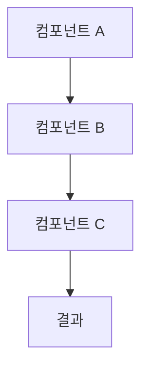

# 강의 문서 표준 템플릿

이 템플릿은 기술 강의 문서의 표준 구조를 제공합니다. 주제에 따라 섹션을 추가하거나 제거할 수 있습니다.

---

# {기술명} 완벽 가이드

> {기술에 대한 한 줄 설명}

**작성일:** {날짜}
**대상:** {초급/중급/고급} 개발자
**예상 학습 시간:** {시간}

## 목차

1. [개요](#1-개요)
2. [시작하기](#2-시작하기)
3. [핵심 개념](#3-핵심-개념)
4. [사용법](#4-사용법)
5. [실무 예제](#5-실무-예제)
6. [베스트 프랙티스](#6-베스트-프랙티스)
7. [트러블슈팅](#7-트러블슈팅)
8. [추가 학습 자료](#8-추가-학습-자료)
9. [결론](#9-결론)

---

## 1. 개요

### 1.1 {기술명}란?

{기술의 정의와 목적을 명확하게 설명합니다.}

**핵심 설명:**
- 무엇을 하는 기술인가?
- 어떤 문제를 해결하는가?
- 누가 만들었으며 언제부터 사용되었는가?

### 1.2 주요 특징

{기술의 차별화된 특징을 나열합니다.}

- **특징 1:** 설명
- **특징 2:** 설명
- **특징 3:** 설명
- **특징 4:** 설명

### 1.3 왜 사용하는가?

**장점:**
- 장점 1
- 장점 2
- 장점 3

**고려사항:**
- 고려사항 1
- 고려사항 2

**다른 기술과의 비교:**

| 기능 | {기술명} | {경쟁 기술 1} | {경쟁 기술 2} |
|------|---------|--------------|--------------|
| 특징 1 | O | X | O |
| 특징 2 | O | O | X |
| 특징 3 | X | O | O |

### 1.4 사용 사례

**적합한 경우:**
1. 사례 1
2. 사례 2
3. 사례 3

**부적합한 경우:**
1. 사례 1
2. 사례 2

---

## 2. 시작하기

### 2.1 사전 요구사항

**필수 지식:**
- 지식 1
- 지식 2

**시스템 요구사항:**
- OS: 지원 운영체제
- 메모리: 최소 요구사항
- 디스크: 필요 용량
- 기타: 추가 요구사항

**필수 도구:**
- 도구 1 (버전)
- 도구 2 (버전)
- 도구 3 (버전)

### 2.2 설치 방법

#### macOS

```bash
# Homebrew 사용
brew install {패키지명}

# 또는 수동 설치
curl -O {다운로드 URL}
```

#### Linux (Ubuntu/Debian)

```bash
# apt 사용
sudo apt update
sudo apt install {패키지명}

# 또는 snap 사용
sudo snap install {패키지명}
```

#### Windows

```powershell
# Chocolatey 사용
choco install {패키지명}

# 또는 Scoop 사용
scoop install {패키지명}
```

**설치 확인:**

```bash
{명령어} --version
```

예상 출력:
```
{버전 정보}
```

### 2.3 초기 설정

**기본 설정 파일 생성:**

```bash
{초기화 명령어}
```

**설정 파일 예시 (`{설정 파일명}`):**

```yaml
# 또는 json, toml 등
설정1: 값1
설정2: 값2
```

**환경 변수 설정 (선택사항):**

```bash
export {변수명}={값}
```

### 2.4 첫 번째 프로젝트

**Hello World 예제:**

1. 프로젝트 디렉토리 생성
   ```bash
   mkdir my-first-project
   cd my-first-project
   ```

2. 초기 파일 생성
   ```bash
   {생성 명령어}
   ```

3. 코드 작성 (`{파일명}`)
   ```{언어}
   # Hello World 코드
   ```

4. 실행
   ```bash
   {실행 명령어}
   ```

5. 예상 출력
   ```
   Hello, World!
   ```

---

## 3. 핵심 개념

### 3.1 기본 개념

**개념 1: {이름}**

{설명}

```{언어}
// 예제 코드
```

**개념 2: {이름}**

{설명}

```{언어}
// 예제 코드
```

### 3.2 주요 기능

#### 기능 1: {이름}

**용도:** {언제 사용하는가}

**사용법:**
```{언어}
// 코드 예제
```

**주요 옵션:**
- `옵션1`: 설명
- `옵션2`: 설명

#### 기능 2: {이름}

{동일한 패턴 반복}

### 3.3 작동 원리

**아키텍처 개요:**



**처리 흐름:**
1. 단계 1
2. 단계 2
3. 단계 3

---

## 4. 사용법

### 4.1 기본 사용법

**기본 명령어/API:**

```{언어}
// 가장 기본적인 사용 예제
```

**설명:**
- 코드의 각 부분이 하는 일
- 파라미터 설명
- 반환값 설명

### 4.2 주요 기능 활용

#### 기능 A 사용하기

**시나리오:** {어떤 상황에서 사용}

**코드:**
```{언어}
// 구현 코드
```

**결과:**
```
예상 출력
```

#### 기능 B 사용하기

{동일한 패턴 반복}

### 4.3 고급 기능

#### 고급 기능 1

{복잡한 기능 설명}

**전제 조건:**
- 조건 1
- 조건 2

**구현:**
```{언어}
// 고급 예제 코드
```

### 4.4 설정 및 커스터마이징

**커스터마이징 옵션:**

| 옵션 | 기본값 | 설명 |
|------|--------|------|
| 옵션1 | 값1 | 설명1 |
| 옵션2 | 값2 | 설명2 |

**설정 예제:**
```{언어}
// 커스터마이징 코드
```

---

## 5. 실무 예제

### 5.1 예제 1: {실무 시나리오 제목}

**학습 목표:**
- 목표 1
- 목표 2
- 목표 3

**시나리오:**

{실제 업무에서 마주칠 수 있는 상황 설명}

**프로젝트 구조:**
```
project/
├── src/
│   ├── main.{확장자}
│   └── utils.{확장자}
├── tests/
│   └── test_main.{확장자}
├── config.{확장자}
└── README.md
```

**구현 단계:**

#### Step 1: 프로젝트 설정

```bash
# 의존성 설치
{설치 명령어}
```

#### Step 2: 핵심 로직 구현

`src/main.{확장자}`:
```{언어}
// 주요 코드
// 각 부분에 한글 주석
```

#### Step 3: 설정 파일 작성

`config.{확장자}`:
```{언어}
// 설정 내용
```

#### Step 4: 테스트 작성

`tests/test_main.{확장자}`:
```{언어}
// 테스트 코드
```

#### Step 5: 실행 및 확인

```bash
# 실행 명령어
{명령어}
```

**결과:**
```
[예상 출력 전체]
```

**코드 설명:**

1. **초기화 부분**: {설명}
2. **메인 로직**: {설명}
3. **에러 처리**: {설명}
4. **결과 반환**: {설명}

**확장 아이디어:**
- 기능 추가 1
- 기능 추가 2
- 성능 최적화 아이디어

### 5.2 예제 2: {두 번째 실무 시나리오}

{예제 1과 동일한 구조로 작성}

### 5.3 예제 3: {세 번째 실무 시나리오}

{예제 1과 동일한 구조로 작성}

---

## 6. 베스트 프랙티스

### 6.1 성능 최적화

**최적화 기법 1: {이름}**

**문제:**
```{언어}
// 비효율적인 코드
```

**개선:**
```{언어}
// 최적화된 코드
```

**효과:** {성능 개선 수치}

### 6.2 보안 고려사항

**보안 이슈 1: {이슈명}**

**위험:**
```{언어}
// 취약한 코드
```

**해결:**
```{언어}
// 안전한 코드
```

**추가 권장사항:**
- 권장사항 1
- 권장사항 2

### 6.3 테스트 전략

**단위 테스트:**
```{언어}
// 테스트 예제
```

**통합 테스트:**
```{언어}
// 통합 테스트 예제
```

**테스트 커버리지 목표:** {목표 퍼센트}

### 6.4 프로덕션 배포

**체크리스트:**
- [ ] 환경 변수 설정
- [ ] 로깅 구성
- [ ] 에러 모니터링 설정
- [ ] 성능 모니터링 설정
- [ ] 백업 전략 수립
- [ ] 롤백 계획 준비

**배포 스크립트:**
```bash
# 배포 자동화 스크립트
```

---

## 7. 트러블슈팅

### 7.1 자주 발생하는 오류

#### 오류 1: {오류 메시지}

**증상:**
```
오류 메시지 전체
```

**원인:**
- 원인 1
- 원인 2

**해결 방법:**

1. 방법 1
   ```bash
   {명령어}
   ```

2. 방법 2
   ```bash
   {명령어}
   ```

**예방:**
- 예방책 1
- 예방책 2

#### 오류 2: {오류 메시지}

{동일한 패턴 반복}

### 7.2 디버깅 팁

**디버그 모드 활성화:**
```bash
{디버그 명령어}
```

**로그 확인:**
```bash
{로그 조회 명령어}
```

**유용한 디버깅 도구:**
- 도구 1: {용도}
- 도구 2: {용도}

### 7.3 성능 문제 해결

**성능 프로파일링:**
```bash
{프로파일링 명령어}
```

**병목 지점 분석:**
- 분석 방법 1
- 분석 방법 2

**최적화 전략:**
- 전략 1
- 전략 2

---

## 8. 추가 학습 자료

### 8.1 공식 문서

- [공식 홈페이지]({URL})
- [API 레퍼런스]({URL})
- [공식 튜토리얼]({URL})
- [GitHub 저장소]({URL})

### 8.2 추천 튜토리얼

**초급:**
- 튜토리얼 1: {제목} - {URL}
- 튜토리얼 2: {제목} - {URL}

**중급:**
- 튜토리얼 3: {제목} - {URL}
- 튜토리얼 4: {제목} - {URL}

**고급:**
- 튜토리얼 5: {제목} - {URL}
- 튜토리얼 6: {제목} - {URL}

### 8.3 커뮤니티 리소스

**포럼 및 Q&A:**
- Stack Overflow 태그: [{태그명}]({URL})
- Reddit: [r/{subreddit}]({URL})
- Discord: [{서버명}]({URL})

**블로그 및 아티클:**
- 추천 블로그 1
- 추천 블로그 2

**동영상 강의:**
- YouTube 채널 추천
- Udemy/Coursera 강의

---

## 9. 결론

### 9.1 핵심 요약

**이 가이드에서 배운 내용:**

1. **기초:**
   - 개념 1
   - 개념 2

2. **실전:**
   - 기법 1
   - 기법 2

3. **고급:**
   - 패턴 1
   - 패턴 2

**주요 명령어/API 요약:**

```{언어}
// 가장 자주 사용하는 코드 스니펫
```

### 9.2 다음 단계

**단기 목표 (1-2주):**
- [ ] 기본 예제 모두 실습
- [ ] 간단한 개인 프로젝트 진행
- [ ] 공식 문서 읽기

**중기 목표 (1-2개월):**
- [ ] 실무 프로젝트에 적용
- [ ] 고급 기능 학습
- [ ] 커뮤니티 기여

**장기 목표 (3-6개월):**
- [ ] 복잡한 시스템 구축
- [ ] 오픈소스 기여
- [ ] 다른 사람 멘토링

**추천 학습 경로:**
1. 관련 기술 A 학습
2. 관련 기술 B 학습
3. 통합 프로젝트 진행

---

**피드백 환영:**

이 가이드에 대한 피드백이나 질문이 있다면 언제든지 연락주세요!

- Email: {이메일}
- GitHub Issues: {URL}
- 블로그: {URL}

**라이선스:** [MIT License](LICENSE)

**마지막 업데이트:** {날짜}
